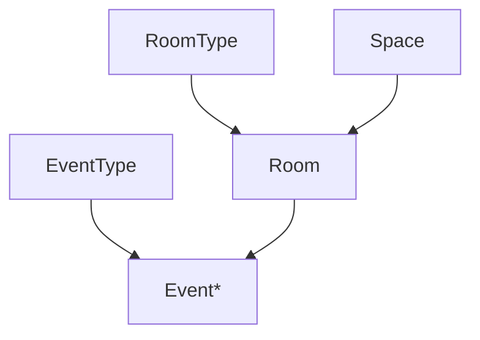
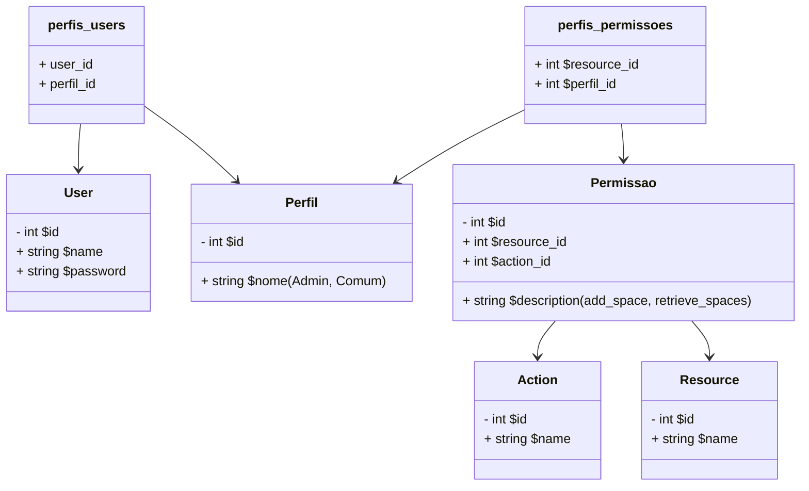

# SETUP LARAVEL / MYSQL

Uma base de aplicação laravel, com Docker, Nginx e Mysql para estudos em PHP Orientado a objetos, com o framework Laravel.

Essa estrutura já está dockerizada, então basta ter o docker compose rodando em seu computador que é pra dar tudo certo.

## Tecnologias

- PHP 8.3
- MySQL
- nginx
- Laravel 11

## Como usar

Primeiro basta clonar o repositório

`git clone https://github.com/alessandrofeitoza/laravel-api-events`

Agora entre na pasta com o terminal 
`cd laravel-api-events`

E agora basta rodar o docker

`docker compose up -d`

Pronto,é sucesso!

## Instalar

Entre no container:

`docker compose exec php bash`

E execute o composer install:

`composer install`

Para executar as migrations
`php artisan migrate`

Para executar criar alguns dados falsos
`php artisan db:seed`

Pronto, agora acesse o http://localhost:8080

---

### Schema do Banco de Dados

--- 
Esquema de autorizacao do usuario;

